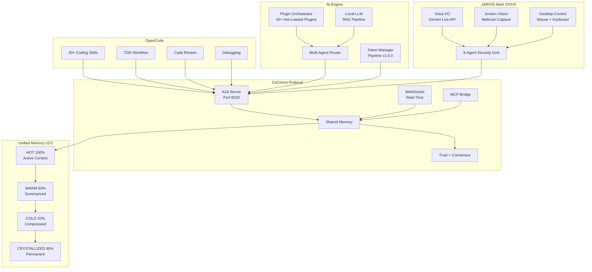
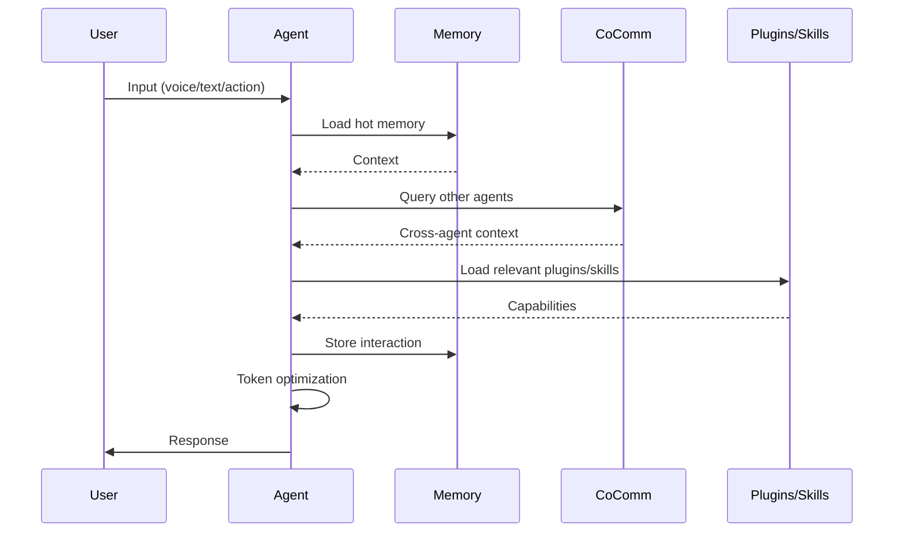
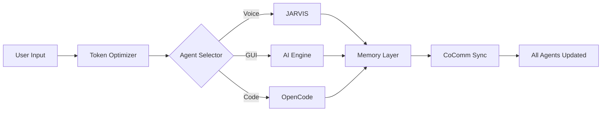

# Architecture Overview

## Triple-Agent Architecture



## Agent Loop



## Data Flow



## Directory Layout

```
LAIS/
├── models/
│   ├── Mark-XXXIX/          # JARVIS voice AI
│   │   ├── main.py          # Voice + vision loop
│   │   └── config/          # API keys
│   └── ai_engine/           # AI Engine
│       ├── unified_layer/   # 60 modules
│       ├── agent/           # Agent modules
│       ├── plugins/         # 40+ plugins
│       ├── skills/          # 30+ skills
│       ├── cli/             # CLI tools
│       └── knowledge/       # RAG, memory
├── config/
│   └── system.json          # Shared config
├── addons/
│   └── token-optimizer/     # v1.0.0 pipeline
│   └── api_server.py        # Headless REST API
├── install.ps1              # Windows one-liner
├── install.sh               # Linux/macOS installer
└── install.py               # 7-phase Python installer
```

## Key Design Decisions

1. **Vault as source of truth** — All protocols, memory, and agent configurations live in an Obsidian vault directory
2. **Memory Architecture v3.0** — Four-tier memory with graduated compression and automatic promotion/demotion
3. **Token Optimization v1.0.0** — Multi-library pipeline that compresses prompts 40-60%
4. **CoComm Protocol** — 18 modules for full cross-agent communication
5. **Progressive Skill Loading** — Skills loaded on demand, not at startup (3 levels: metadata → body → resources)
