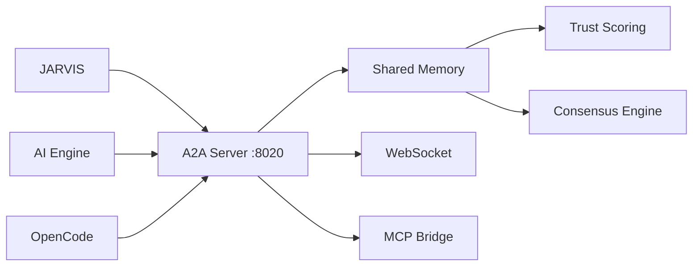

# CoComm Cross-Agent Communication Protocol

CoComm is an 18-module framework for multi-agent communication.

## Modules

| Module | Port | Purpose |
|--------|------|---------|
| `a2a_server` | 8020 | Agent-to-agent HTTP server (A2A v1.0 spec) |
| `websocket_server` | Dynamic | Real-time WebSocket messaging |
| `mcp_bridge` | — | Model Context Protocol bridge |
| `vault_sync` | — | Obsidian vault synchronization |
| `trigger` | — | Event-driven triggers |
| `session_log` | — | Active session tracking |
| `shared_memory` | — | Cross-agent memory store |
| `config` | — | Configuration management |
| `roles` | — | Agent role definitions |
| `handoff` | — | Task handoff protocols |
| `async_agent` | — | Async agent execution |
| `goal_planner` | — | Multi-agent goal planning |
| `consensus` | — | Decision consensus |
| `graph_evolution` | — | Dynamic knowledge graph |
| `trust` | — | Trust scoring and validation |
| `memory_sync` | — | Memory synchronization |
| `opencode_bridge` | — | OpenCode session sync |
| `start_hub` | — | Central hub for launching services |

## A2A Protocol

The A2A server implements the [A2A v1.0 specification](https://github.com/google/A2A):

```
GET  /.well-known/agent-card    → Agent discovery
POST /a2a/tasks                 → Submit task
GET  /a2a/tasks/{id}            → Task status
GET  /status                    → Server health
```

## Architecture



## Starting

```bash
# Start A2A server
python -m models.ai_engine.unified_layer.a2a_server

# Or via Docker
docker compose up lais-a2a
```
