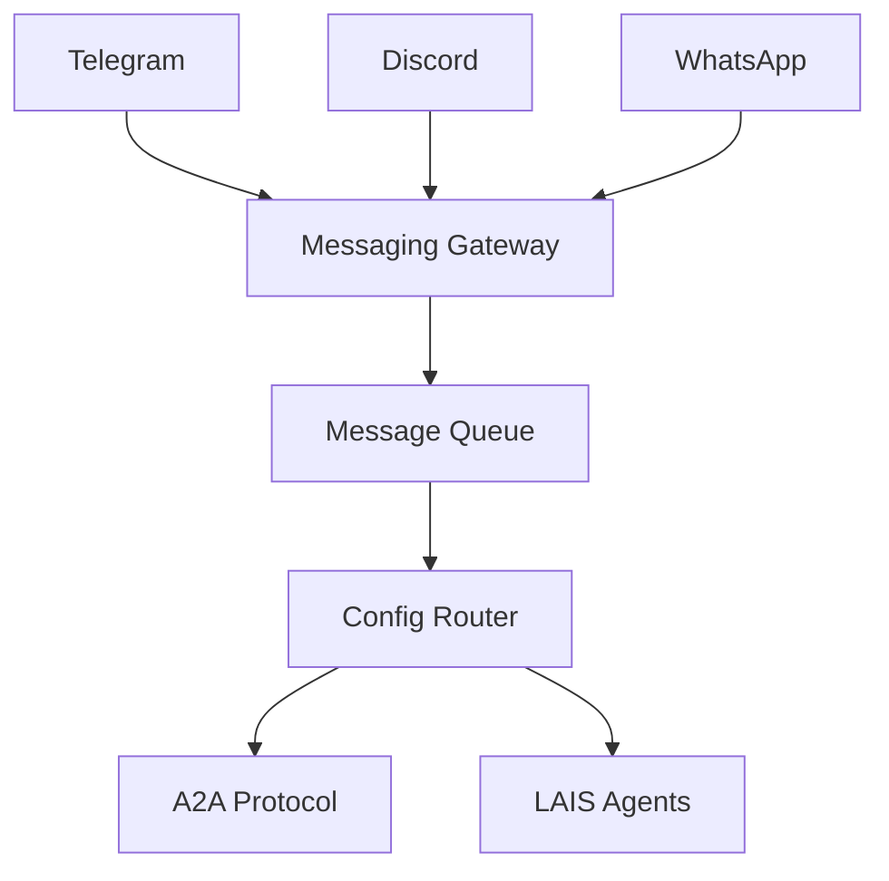

# Messaging Gateways

Send and receive messages from Telegram, Discord, and WhatsApp through the unified LAIS messaging system.

## Architecture



## Setup

### Telegram

1. Create a bot via [@BotFather](https://t.me/BotFather)
2. Add the token to `config/messaging.json`
3. Install: `pip install lais-ai[telegram]`

```json
{
  "telegram": {
    "enabled": true,
    "token": "YOUR_BOT_TOKEN",
    "allowed_users": ["username1", "username2"]
  }
}
```

### Discord

1. Create a bot in [Discord Developer Portal](https://discord.com/developers/applications)
2. Add the token to `config/messaging.json`
3. Install: `pip install lais-ai[discord]`

### WhatsApp

Uses webhook-based integration (Twilio or whatsapp-web.js). See `docs/messaging-setup.md` for details.

## Usage

```python
from unified_layer.messaging_gateway import MessagingGateway

gateway = MessagingGateway("config/messaging.json")
await gateway.send_message("telegram", "Hello from LAIS!")
```

## All-in-One Install

```bash
pip install lais-ai[messaging]
```

This installs Telegram, Discord, and WhatsApp support.
