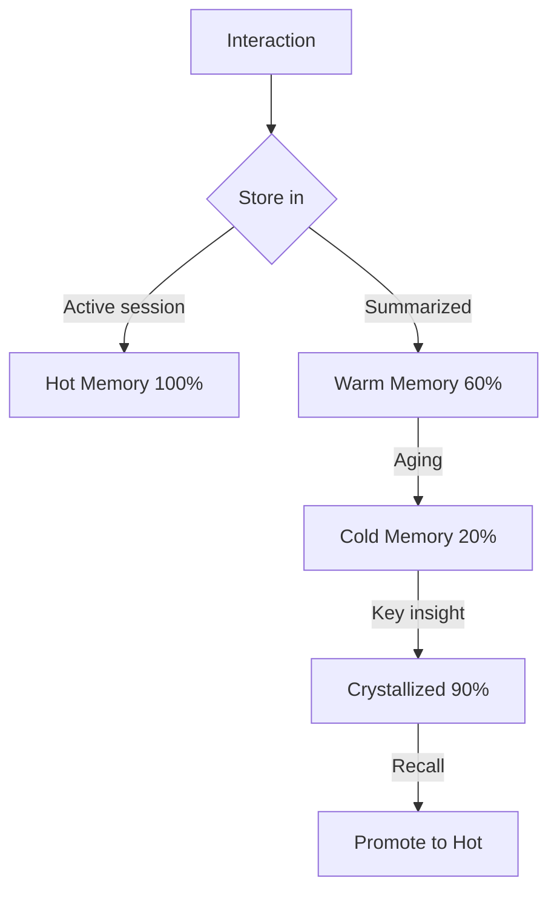

# Memory Architecture v3.0

## 4-Layer System

| Layer | Retention | Purpose |
|-------|-----------|---------|
| **Hot** | 100% | Active context, current session |
| **Warm** | 60% | Summarized recent interactions |
| **Cold** | 20% | Metadata only, full compression |
| **Crystallized** | 90% | Key learnings, permanent storage |

## 5-Tier Session Continuity

| Tier | Compression | Auto-Execute |
|------|-------------|-------------|
| Active | 0% | Yes — full context preservation |
| Working | 40% | Yes — frequently used patterns |
| Supporting | 70% | No — on-demand retrieval |
| Archived | 85% | No — manual request only |
| Obsolete | 95% | No — emergency recovery |

## Token Budget Allocation

| Component | Budget |
|-----------|--------|
| Hot Memory | 15-25% |
| Warm Memory | 20-30% |
| Cold Memory | 5-10% |
| Crystallized | 10-15% |
| Working Memory | 30-40% |
| Buffer | 10% |

Automatic rebalancing triggers at 80% utilization.

## Flow

## Storage

- **Hot**: In-memory dict with TTL
- **Warm**: JSON files with `opencode_sessions.json` and `crystallized.json`
- **Cold**: Compressed JSON with metadata-only retention
- **Crystallized**: Permanent `crystallized.json` with 90% compression
