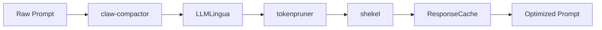

# Token Optimization Pipeline v1.0.0

## Overview

Four compression engines working in sequence to reduce token usage by 40-60%.

## Components

| Component | Compression | Purpose |
|-----------|-------------|---------|
| claw-compactor | 14-stage | Content-type-aware compression (markdown stripping, dedup, whitespace normalization) |
| LLMLingua | 20x | Microsoft semantic compression using BERT-level model |
| tokenpruner | 40-60% | COMPOSITE strategy dedup compression |
| shekel | Per-agent | USD budget enforcement (warn at 80%, stop at 100%) |
| sqz | Variable | Shell output compressor (LRU dedup cache) |
| ResponseCache | TTL-based | Response deduplication within TTL window |

## Usage

```python
from unified_layer.token_optimizer import get_token_optimizer

opt = get_token_optimizer("opencode")
report = opt.get_report()
print(report)  # Full token usage + savings
```

## Environment Variables

| Variable | Default | Description |
|----------|---------|-------------|
| `LAIS_TOKEN_OPTIMIZATION` | 1 | Enable/disable token optimization |
| `LAIS_SQZ_ENABLED` | 1 | Enable shell output compression |
| `LAIS_BUDGET_ENABLED` | 1 | Enable per-agent budget enforcement |

## Pipeline Flow


